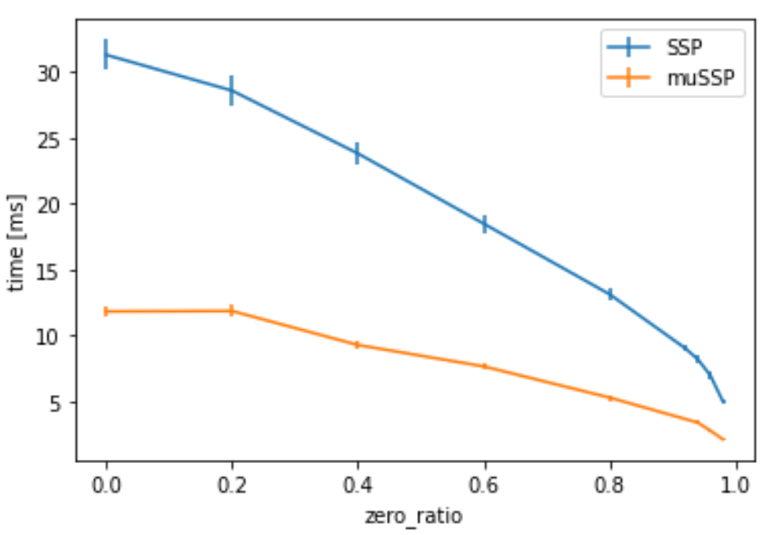

# multi object tracker

This multi object tracker consists of data association and EKF.

## Data association
The data association performs maximum score matching, called min cost max flow problem.
In this package, mussp[1] is used as solver.
In addition, when associating observations to tracers, data association have gates such as the area of the object from the BEV, Mahalanobis distance, and maximum distance, depending on the class label.

## EKF Tracker
Models for pedestrians, bicycles (motorcycles), and cars are available.
The pedestrian or bicycle tracker is running at the same time as the respective EKF model in order to enable the transition between pedestrian and bicycle tracking.
For big vehicles such as trucks and buses, we have separate models for passenger cars and large vehicles because they are difficult to distinguish from passenger cars and are not stable. Therefore, separate models are prepared for passenger cars and big vehicles, and these models are run at the same time as the respective EKF models to ensure stability.

## Note
This package makes use of external code.

|  Name  | License | Original Repository  |
| ---- | ---- | ---- |
| [muSSP](src/data_association/mu_successive_shortest_path/impl) | [Apache 2.0](src/data_association/mu_successive_shortest_path/impl) | https://github.com/yu-lab-vt/muSSP |

### Evaluation of muSSP
According to our evaluation, muSSP is faster than normal [SSP](src/data_association/successive_shortest_path) when the matrix size is more than 100.

Execution time for varying matrix size at 95% sparsity. In real data, the sparsity was often around 95%.

Execution time for varying the sparsity with matrix size 100.

## Reference
[1] C. Wang, Y. Wang, Y. Wang, C.-t. Wu, and G. Yu, “muSSP: Efficient
Min-cost Flow Algorithm for Multi-object Tracking,” NeurIPS, 2019
